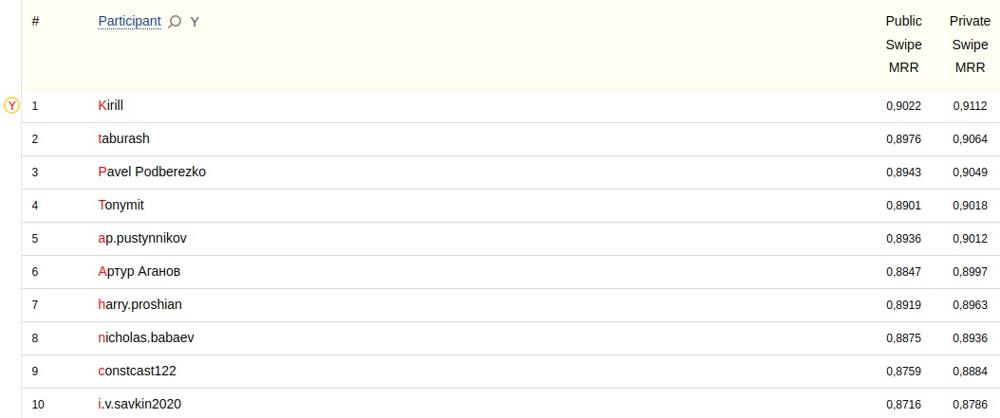

# Yandex Cup 2023 Machine Learning Challenge: NeuroSwipe

- [Yandex Cup 2023 Machine Learning Challenge](https://yandex.com/cup/ml/)

[Yandex Cup 2023 Machine Learning Challenge: NeuroSwipe](https://contest.yandex.com/contest/54253/problems/)
Develop AI model for predicting words of swipe typing.

[1st place](https://contest.yandex.com/contest/54253/standings/) out of 50
participants with 0.9112 Swipe MRR (top2 0.9064, top3 0.9049).



Time spent


## Approach

The approach is based on Seq2seq with Bahdanau attention. Encoder takes 2D
curve as input and decoder outputs a sequence of chars. We model the keyboard
as a `m x n x d` (4 x 8 x 128) image with `d` channels where each pixel plays a
role of a key. For each coordinate `x, y` we sample embedding using bilinear
interpolation. The resulting embeddings are passed to the encoder. The rest of
implementation is based on
[pytorch tutorial](https://pytorch.org/tutorials/intermediate/seq2seq_translation_tutorial.html).
We optimize cross-entropy with label smoothing using AdamW optimizer and
CosineAnnelingLR scheduler with warmup. We inject random noise to curves.

## Highlights

- char-level seq2seq (LSTM)
- inputs are curves, outputs are sequence of chars
- label smoothing
- beam search
- fix non vocab words via the [Levenshtein Distance](https://github.com/maxbachmann/RapidFuzz)

## Prerequisites & Hardware

- GNU/Linux 4.18.0-477.21.1.el8_8.x86_64
- [Python 3.11.5](https://www.python.org/) (GCC 11.3.0)
- Nvidia driver version: 535.104.12
- CUDA version: 12.2
- NVIDIA A100-SXM4-40GB
- [PyTorch 2.0.1](https://pytorch.org/)
- CPU AMD Milan 7413 @ 2.65 GHz 128M cache L3
- 64 GB RAM
- [`jq` to parse json](https://jqlang.github.io/jq/)

## Setup & Inference

Download the data from the competition page and unzip into `data` folder. Then
download pretrained models from [yandex disk](https://yadi.sk/d/4oyVFBWxLXs-Pw).

Preprocess test file

```bash
sh ./preprocess.sh ./data test
```

Finally, run the script to produce the `submission.csv`

```bash
sh ./submit.sh

python ./src/fix_nonvocab.py --sub-path ./submission.csv --voc-path ./vocab_words.csv --out-path ./submission_fix.csv --use-beam

sed -i '1,1d; s/^кек,//' ./submission_fix.csv
```

The inference takes ~1 hour on 1 GPU V100 32GB. Note, the beam search
implementation is extremely inefficient. Without beam search inference takes ~1
minute.

## Train

To train a model from scratch first create .csv files from .jsonl via

```bash
sh ./preprocess.sh ./data train
sh ./preprocess.sh ./data valid
```

and then train the model

```bash
sh ./run.sh
```

It takes ~7 hours on 1 A100 to train the model to achieve good
results (~7 epochs). You may stop training after 10-20 epochs.
